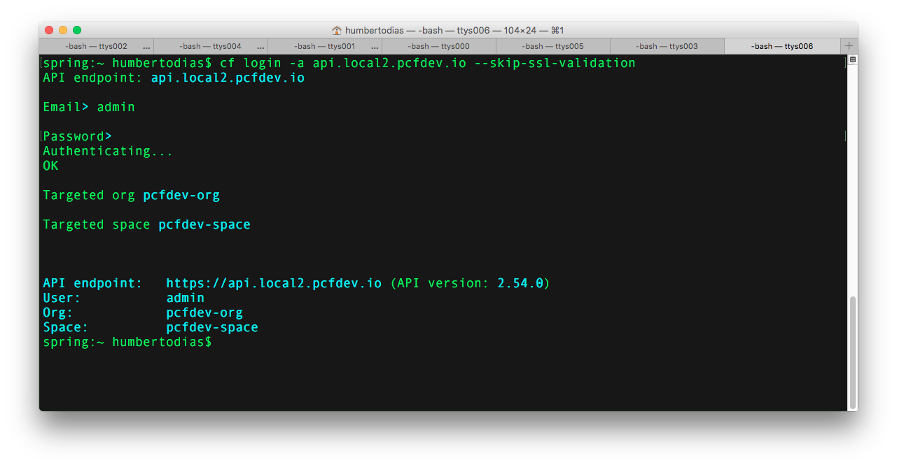

# Vagrant Cloud Foundry Locally

PCF Dev is the simplest way to get a complete Cloud Foundry on a single machine.


## Prerequires

1. Git 2.9+
2. VirtualBox 5+
3. Vagrant 1.8+
4. Cloud Foundry Command Line Interface 6+
5. Pivotal Account

## How to Play

Clone

```
git clone https://github.com/humbertodias/vagrant-cloud-foundry-dev.git
```

Inside the folder

```
cd vagrant-cloud-foundry-dev
```

Unzip and Run it for your platform

```
unzip pcfdev-v0.20.0+PCF1.8.0-osx.zip && ./pcfdev-v0.20.0+PCF1.8.0-osx && cf dev start
```

or

```
unzip pcfdev-v0.20.0+PCF1.8.0-linux.zip && ./pcfdev-v0.20.0+PCF1.8.0-linux && cf dev start
```

or

```
unzip pcfdev-v0.20.0+PCF1.8.0-windows.zip && pcfdev-v0.20.0+PCF1.8.0-windows.exe && cf dev start
```

Finally, access your Pivotal User profile to take the API Token

[https://network.pivotal.io/users/dashboard/edit-profile](https://network.pivotal.io/users/dashboard/edit-profile)


API Token


## Output
```
Starting VM...
Provisioning VM...
Waiting for services to start...
9 out of 53 running
9 out of 53 running
9 out of 53 running
43 out of 53 running
53 out of 53 running
 _______  _______  _______    ______   _______  __   __
|       ||       ||       |  |      | |       ||  | |  |
|    _  ||       ||    ___|  |  _    ||    ___||  |_|  |
|   |_| ||       ||   |___   | | |   ||   |___ |       |
|    ___||      _||    ___|  | |_|   ||    ___||       |
|   |    |     |_ |   |      |       ||   |___  |     |
|___|    |_______||___|      |______| |_______|  |___|
is now running.
To begin using PCF Dev, please run:
   cf login -a https://api.local.pcfdev.io --skip-ssl-validation
Apps Manager URL: https://local.pcfdev.io
Admin user => Email: admin / Password: admin
Regular user => Email: user / Password: pass
```

## Output



## References

1. PCF-Dev Doc
	
	[https://docs.pivotal.io/pcf-dev/](https://docs.pivotal.io/pcf-dev/)

2. PCF-Dev Download

	[https://network.pivotal.io/products/pcfdev](https://network.pivotal.io/products/pcfdev)
	
3. Cloud Foundry Command Line Interface

	[https://docs.pivotal.io/pcf-dev/install-osx.html#cf-cli](https://docs.pivotal.io/pcf-dev/install-osx.html#cf-cli)