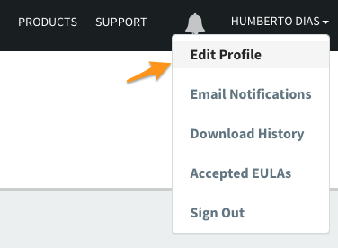
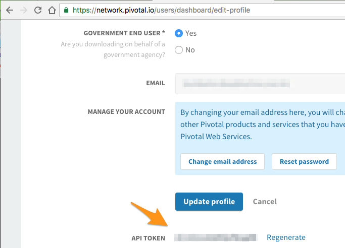
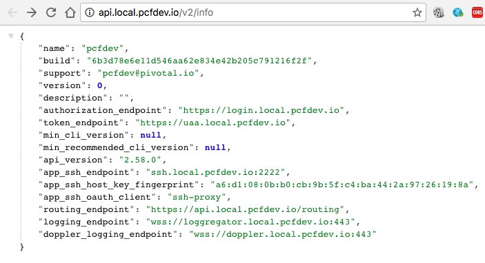

# Vagrant Cloud Foundry Locally

PCF Dev is the simplest way to get a complete Cloud Foundry on a single machine.


## Prerequires

1. [Git](https://git-scm.com/downloads) 2.9+
2. [VirtualBox](https://www.virtualbox.org/wiki/Downloads) 5+
3. [Cloud Foundry Command Line Interface](https://docs.cloudfoundry.org/cf-cli/install-go-cli.html) 6+
4. [Pivotal Account](https://network.pivotal.io)

## How to Play

Clone

```
git clone https://github.com/humbertodias/vagrant-cloud-foundry-dev.git
```

Inside the folder

```
cd vagrant-cloud-foundry-dev
```

Unzip and Run it for your platform

```
unzip pcfdev-v0.24.0+PCF1.9.0-osx.zip && ./pcfdev-v0.24.0+PCF1.9.0-osx && cf dev start
```

or

```
unzip pcfdev-v0.24.0+PCF1.9.0-linux.zip && ./pcfdev-v0.24.0+PCF1.9.0-linux && cf dev start
```

or

```
unzip pcfdev-v0.24.0+PCF1.9.0-windows.zip && pcfdev-v0.24.0+PCF1.9.0-windows.exe && cf dev start
```

Finally, access your Pivotal User profile to take the API Token

[https://network.pivotal.io/users/dashboard/edit-profile](https://network.pivotal.io/users/dashboard/edit-profile)



API Token




## Output

```
Starting VM...
Provisioning VM...
Waiting for services to start...
9 out of 53 running
9 out of 53 running
9 out of 53 running
43 out of 53 running
53 out of 53 running
 _______  _______  _______    ______   _______  __   __
|       ||       ||       |  |      | |       ||  | |  |
|    _  ||       ||    ___|  |  _    ||    ___||  |_|  |
|   |_| ||       ||   |___   | | |   ||   |___ |       |
|    ___||      _||    ___|  | |_|   ||    ___||       |
|   |    |     |_ |   |      |       ||   |___  |     |
|___|    |_______||___|      |______| |_______|  |___|
is now running.
To begin using PCF Dev, please run:
   cf login -a https://api.local.pcfdev.io --skip-ssl-validation
Apps Manager URL: https://local.pcfdev.io
Admin user => Email: admin / Password: admin
Regular user => Email: user / Password: pass
```

## Information

Acess on browser [http://api.local.pcfdev.io/v2/info](http://api.local.pcfdev.io/v2/info)




## Remote Access

SSH connection

```
ssh vcap@ssh.local.pcfdev.io
```

Use **vcap** as user and password.

```
SSH_USER=vcap
SSH_PASS=vcap
SSH_HOST=ssh.local.pcfdev.io

ssh $SSH_USER@$SSH_HOST

vcap@ssh.local.pcfdev.io's password: 
Welcome to Ubuntu 14.04.5 LTS (GNU/Linux 3.19.0-69-generic x86_64)

 * Documentation:  https://help.ubuntu.com/
Last login: Sun Oct  9 03:44:07 2016 from 192.168.11.1

vcap@agent-id-pcfdev-0:~$ uname -a
Linux agent-id-pcfdev-0 3.19.0-69-generic #77~14.04.1-Ubuntu SMP Tue Aug 30 01:29:21 UTC 2016 x86_64 x86_64 x86_64 GNU/Linux
```

## Console

[https://apps-manager.local.pcfdev.io](https://apps-manager.local.pcfdev.io)


# UAA Server

User Account and Authentication

```
ADMIN=admin
ADMINPASSWD=admin-client-secret

# localhost deployed UAA
UAAHOST=https://uaa.local.pcfdev.io

# targeting UAA server
uaac target $UAAHOST --skip-ssl-validation

# authenticating with admin
uaac token client get $ADMIN -s $ADMINPASSWD
```

##  Output

```
Target: https://uaa.local.pcfdev.io
Context: admin, from client admin

Successfully fetched token via client credentials grant.
Target: https://uaa.local.pcfdev.io
Context: admin, from client admin
```

## References

1. PCF-Dev Doc
	
	[https://docs.pivotal.io/pcf-dev/](https://docs.pivotal.io/pcf-dev/)

2. PCF-Dev Download

	[https://network.pivotal.io/products/pcfdev](https://network.pivotal.io/products/pcfdev)
	
3. Cloud Foundry Command Line Interface

	[https://docs.pivotal.io/pcf-dev/install-osx.html#cf-cli](https://docs.pivotal.io/pcf-dev/install-osx.html#cf-cli)